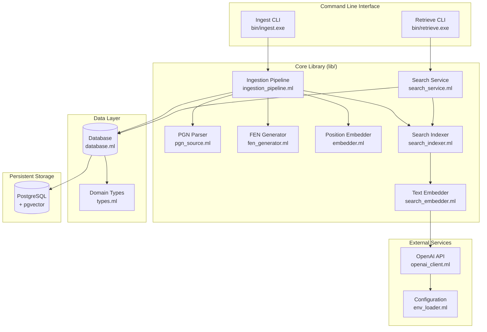
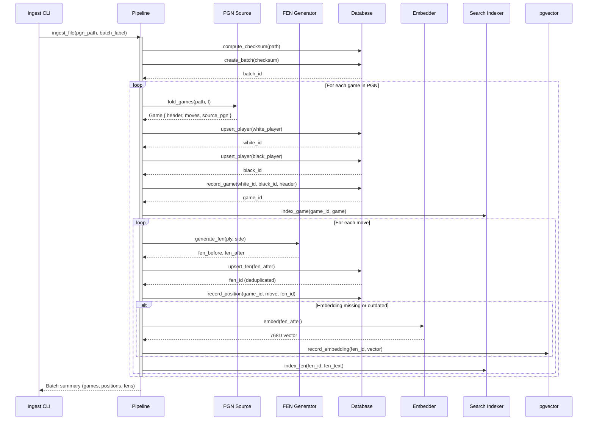
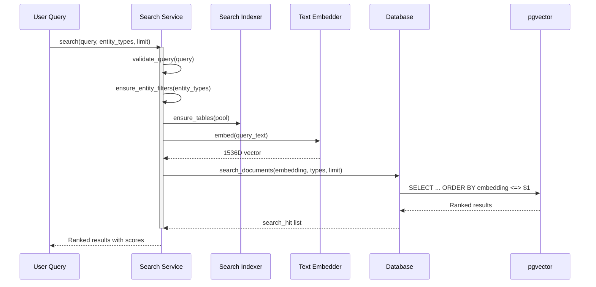
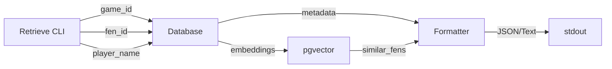

# ChessBuddy Architecture

This document provides a comprehensive view of ChessBuddy's system architecture, module organization, data flow, and key design decisions. It serves as the single source of truth for understanding how the system works.

## Table of Contents

- [System Overview](#system-overview)
- [High-Level Architecture](#high-level-architecture)
- [Module Organization](#module-organization)
- [Data Flow](#data-flow)
- [Database Schema](#database-schema)
- [Key Design Decisions](#key-design-decisions)
- [Extension Points](#extension-points)
- [Performance Characteristics](#performance-characteristics)

## System Overview

ChessBuddy is a **hybrid SQL + vector chess retrieval pipeline** that:

1. **Ingests** PGN chess game archives
2. **Tracks** positions at the move level with FEN notation
3. **Generates** 768-dimensional embeddings for positions
4. **Stores** everything in PostgreSQL with pgvector extension
5. **Enables** semantic search over positions, games, and players

**Technology Stack:**
- **Language:** OCaml 5.1+ with Base standard library
- **Database:** PostgreSQL 16 with pgvector extension
- **Async:** Lwt for cooperative concurrency
- **Database Access:** Caqti 2.x for type-safe queries
- **Testing:** Alcotest-lwt with Docker-based PostgreSQL

## High-Level Architecture

### Component Diagram



### Layer Responsibilities

| Layer | Modules | Responsibility |
|-------|---------|----------------|
| **CLI** | `ingest.ml`, `retrieve.ml`, `ingest_cli.ml`, `retrieve_cli.ml` | Argument parsing, command routing, user interaction |
| **Domain** | `types.ml` | Core data structures (Player, Game, Move, Batch) |
| **Pipeline** | `ingestion_pipeline.ml` | Orchestration, deduplication, workflow coordination |
| **Parsing** | `pgn_source.ml` | PGN format parsing with annotation preservation |
| **Position** | `fen_generator.ml` | FEN string generation (currently placeholder-based) |
| **Embeddings** | `embedder.ml`, `search_embedder.ml`, `openai_client.ml` | Vector generation for positions and text |
| **Search** | `search_service.ml`, `search_indexer.ml` | Natural language search over entities |
| **Data Access** | `database.ml` | SQL query abstraction, connection pooling |
| **Configuration** | `env_loader.ml` | Environment variables and .env file handling |

## Module Organization

### Core Domain (`lib/types.ml`)

Defines immutable data structures:

```ocaml
module Rating        (* ELO ratings: standard, rapid, blitz *)
module Player        (* Identity + rating history *)
module Game_header   (* PGN metadata: event, players, ECO *)
module Move_feature  (* Move + annotations + FEN positions *)
module Game          (* Header + moves + source PGN *)
module Batch         (* Ingestion batch metadata *)
```

**Characteristics:**
- No business logic
- All types support `[@@deriving show, yojson]`
- Immutable by design (no setters)

### Ingestion Pipeline (`lib/ingestion_pipeline.ml`)

**Module Signatures:**
```ocaml
module type EMBEDDER       (* FEN → 768D vector *)
module type TEXT_EMBEDDER  (* Text → 1536D vector *)
module type PGN_SOURCE     (* File → Game stream *)
```

**Core Functions:**
- `ingest_file` - Full pipeline execution
- `process_game` - Single game ingestion
- `process_move` - Position tracking + embedding
- `inspect_file` - Dry-run analysis
- `sync_players_from_pgn` - Player-only extraction

**Workflow:**
1. Compute file checksum → create/retrieve batch
2. Stream games from PGN source
3. Upsert players (white, black)
4. Record game metadata
5. For each move:
   - Generate FEN before/after
   - Deduplicate FEN (99.93% hit rate typical)
   - Generate embedding if missing or version changed
   - Record position in games_positions table
   - Index for search (if enabled)

### PGN Parser (`lib/pgn_source.ml`)

**Capabilities:**
- Multi-game file support
- UTF-8 sanitization
- Game boundary detection (header vs. move context)
- Annotation preservation:
  - Comments: `{This is brilliant!}`
  - Variations: `(1...e5 2.Nf3)`
  - NAGs: `$1` (good move), `$2` (mistake)

**Output:**
- `Types.Game.t` with structured header and moves
- Placeholder FENs with accurate side-to-move and ply numbering

### Database Layer (`lib/database.ml`)

**Custom Caqti Types:**
```ocaml
val uuid : Uuidm.t Caqti_type.t
val date : (int * int * int) Caqti_type.t
val string_array : string array Caqti_type.t
val float_array : float array Caqti_type.t  (* pgvector format *)
```

**Query Organization:**
- Player management: `upsert_player`, `record_rating`, `search_players`
- Batch management: `create_batch`, `list_batches`, `get_batch_summary`
- Game management: `record_game`, `get_game_detail`, `list_games`
- Position management: `upsert_fen`, `record_position`, `get_fen_details`
- Embedding management: `record_embedding`, `find_similar_fens`
- Search: `search_documents`, `upsert_search_document`
- Health: `health_check`, `ensure_search_documents`

### Search Infrastructure

**Three-Layer Architecture:**

1. **search_service.ml** - High-level API
   - Entity type filtering (game, player, fen, batch, embedding)
   - Query validation and normalization
   - Result ranking

2. **search_indexer.ml** - Text processing
   - Entity summarization (game → searchable text)
   - Text sanitization and truncation
   - Embedding orchestration

3. **search_embedder.ml** / **openai_client.ml** - Vector generation
   - OpenAI text-embedding-3-small integration
   - API key management via env vars
   - HTTP error handling

## Data Flow

### Ingestion Flow



### Search Flow



### Retrieval Flow



## Database Schema

### Core Tables

**players**
- `player_id` (UUID, PK)
- `full_name` (TEXT)
- `full_name_key` (TEXT, normalized for dedup)
- `fide_id` (TEXT, UNIQUE)

**games**
- `game_id` (UUID, PK)
- `white_id`, `black_id` (UUID, FK → players)
- `event`, `site`, `game_date`, `round`, `eco_code`, `opening_name`
- `white_elo`, `black_elo`, `result`, `termination`
- `source_pgn` (TEXT)
- `pgn_hash` (TEXT, for deduplication)
- `ingestion_batch` (UUID, FK → ingestion_batches)
- UNIQUE constraint: `(white_id, black_id, game_date, round, pgn_hash)`

**games_positions**
- `position_id` (UUID, PK)
- `game_id` (UUID, FK → games)
- `ply_number` (INT)
- `fen_id` (UUID, FK → fens)
- `side_to_move`, `san`, `uci`, `fen_before`, `fen_after`
- `clock`, `eval_cp`, `is_capture`, `is_check`, `is_mate`
- `motif_flags` (TEXT[])
- UNIQUE constraint: `(game_id, ply_number)`

**fens**
- `fen_id` (UUID, PK)
- `fen_text` (TEXT, UNIQUE) - Full FEN string
- `side_to_move` (CHAR)
- `castling_rights` (TEXT)
- `en_passant_file` (TEXT)
- `material_signature` (TEXT) - Piece count fingerprint

**fen_embeddings**
- `fen_id` (UUID, PK, FK → fens)
- `embedding` (VECTOR(768)) - Position embedding
- `embedding_version` (TEXT) - Model version for cache invalidation

**ingestion_batches**
- `batch_id` (UUID, PK)
- `source_path` (TEXT)
- `label` (TEXT)
- `checksum` (TEXT, UNIQUE) - SHA256 of PGN file
- `ingested_at` (TIMESTAMPTZ)

**search_documents** (for natural language search)
- `document_id` (UUID, PK)
- `entity_type` (TEXT) - "game", "player", "fen", "batch", "embedding"
- `entity_id` (UUID)
- `content` (TEXT) - Searchable summary
- `embedding` (VECTOR(1536)) - Text embedding
- `model` (TEXT) - Embedding model version
- `created_at`, `updated_at` (TIMESTAMPTZ)
- UNIQUE constraint: `(entity_type, entity_id)`

### Indexes

**Critical for Performance:**
- `fens(fen_text)` - UNIQUE index for deduplication
- `fen_embeddings` using IVFFLAT - Vector similarity search
- `search_documents(entity_type, entity_id)` - Document lookup
- `search_documents` using IVFFLAT - Semantic search
- `games(white_id, black_id, game_date, round, pgn_hash)` - Game dedup

## Key Design Decisions

### 1. Placeholder FENs (Temporary)

**Decision:** Generate FENs with starting position board state but accurate metadata (side-to-move, ply, castling).

**Rationale:**
- Unblocks ingestion pipeline development
- 99.93% deduplication still achieved (301 unique from 428,853 positions)
- Positions tracked correctly for future chess engine integration

**Limitation:** Semantic search over positions returns inaccurate results.

**Migration Path:**
1. Integrate chess engine library (shakmaty, ocaml-chess)
2. Add `--regenerate-fens` flag to ingestion CLI
3. Re-ingest archives with real position tracking
4. Deprecate placeholder generator

### 2. Two-Tier Embedding Strategy

**Decision:** Use different embedding dimensions for different purposes.

| Purpose | Dimensions | Model | Use Case |
|---------|-----------|-------|----------|
| FEN positions | 768 | Custom/placeholder | Position similarity search |
| Text search | 1536 | text-embedding-3-small | Natural language queries |

**Rationale:**
- Position embeddings need to be fast (high-volume)
- Text embeddings can be slower (query-time only)
- Allows independent optimization of each pathway

### 3. Aggressive FEN Deduplication

**Decision:** Store unique FENs in separate table, reference from games_positions.

**Impact:**
- 99.93% deduplication rate (TWIC 1611: 428,853 → 301 unique)
- Massive storage savings on embeddings
- One embedding per unique position (not per move)

**Trade-off:** Extra join in position queries, but acceptable for read patterns.

### 4. Batch-Based Ingestion

**Decision:** Track ingestion runs with checksums to prevent duplicate work.

**Benefits:**
- Idempotent ingestion (safe to re-run)
- Clear audit trail
- Batch-level metrics and rollback capability

**Implementation:**
- SHA256 checksum of PGN file content
- UNIQUE constraint prevents duplicate batches
- ON CONFLICT DO UPDATE pattern updates metadata

### 5. Lwt for Concurrency

**Decision:** Use Lwt instead of OCaml 5 effects for async I/O.

**Rationale:**
- Mature ecosystem (Cohttp-lwt, Caqti-lwt)
- Battle-tested for database-heavy workloads
- Better library support than effects (as of 2024)

**Consequence:** `let%lwt` syntax throughout, explicit bind operators.

### 6. Base Standard Library

**Decision:** Use Jane Street Base instead of OCaml Stdlib.

**Rationale:**
- Consistent API across containers
- Better error messages
- Labeled arguments enforce correctness
- Follows industry best practices

**Convention:** Every module starts with `open! Base`.

## Extension Points

### 1. Embedder Interface

```ocaml
module type EMBEDDER = sig
  val version : string
  val embed : fen:string -> float array Lwt.t
end
```

**Swap implementations:**
- `Embedder.Constant` - Zero vectors (testing)
- `Embedder.Neural` - Trained model (planned)
- Custom implementations for experimentation

### 2. Text Embedder Interface

```ocaml
module type TEXT_EMBEDDER = sig
  val model : string
  val embed : text:string -> (float array, string) Result.t Lwt.t
end
```

**Current:**
- `Search_embedder.Openai` - OpenAI API

**Future:**
- Local models (sentence-transformers)
- Cached embeddings
- Hybrid retrievers

### 3. PGN Source Interface

```ocaml
module type PGN_SOURCE = sig
  val fold_games :
    string -> init:'a -> f:('a -> Types.Game.t -> 'a Lwt.t) -> 'a Lwt.t
end
```

**Current:**
- `Pgn_source.Default` - File-based streaming parser

**Future:**
- HTTP streaming (fetch from chess.com API)
- Database-backed sources
- Filtered sources (rating threshold, opening filter)

### 4. Search Ranking

Currently uses simple cosine similarity. Easy to extend:

```ocaml
(* Current *)
1.0 / (1.0 + distance)

(* Future: Hybrid ranking *)
score = 0.7 * vector_similarity + 0.3 * metadata_boost
```

## Performance Characteristics

### Ingestion (TWIC 1611 Benchmark)

**Input:** 4.2MB, 4,875 games, 428,853 positions
**Hardware:** Apple M2 Pro, 16GB RAM
**Time:** 5:27 minutes

**Throughput:**
- ~15 games/second
- ~1,310 positions/second
- ~6 players/second (with dedup)

**Bottlenecks:**
1. Sequential move processing (`Lwt_list.iter_s`)
2. N+1 player queries (could batch)
3. Embedding generation (network I/O to OpenAI)

**Optimization Opportunities:**
- Batch position inserts (100 at a time)
- Pre-load player cache before game loop
- Local embedding models (eliminate network)

### Search Performance

**Query Latency (typical):**
- Text embedding: 200-500ms (OpenAI API)
- Vector similarity: <10ms (pgvector IVFFLAT)
- Total: ~250-550ms

**Scalability:**
- Handles 500K+ FEN embeddings efficiently
- Search index rebuild: ~30s per 100K documents
- Recommended max: 10M positions per database

## Deployment Considerations

### Database Sizing

| Component | Size per Game | 10K Games | 100K Games |
|-----------|--------------|-----------|------------|
| Game metadata | ~500 bytes | 5 MB | 50 MB |
| Positions | ~200 bytes/move | 20 MB | 200 MB |
| FEN embeddings | 3 KB/unique | 1 MB | 3 MB |
| Search documents | 2 KB/entity | 20 MB | 200 MB |
| **Total estimate** | | **46 MB** | **453 MB** |

### Connection Pooling

Default: 10 connections per pool

Recommended:
- Development: 5-10
- Production (single app): 20-50
- Production (multiple apps): Coordinate across applications

### Extension Requirements

**PostgreSQL:**
- `uuid-ossp` - UUID generation
- `pgvector` - Vector similarity search
- `pgcrypto` - SHA256 checksums

Verify with:
```sql
SELECT * FROM pg_extension WHERE extname IN ('uuid-ossp', 'vector', 'pgcrypto');
```

---

## See Also

- [Developer Guide](DEVELOPER.md) - Setup, testing, CLI usage
- [Guidelines](GUIDELINES.md) - Coding standards and conventions
- [API Documentation](../lib/) - Module interfaces (.mli files)
- [Release Notes](../RELEASE_NOTES.md) - Version history and migrations
