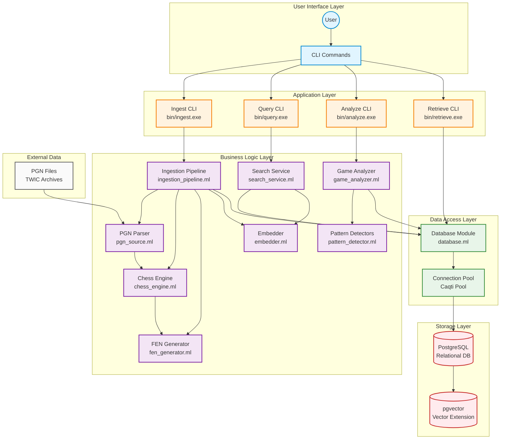
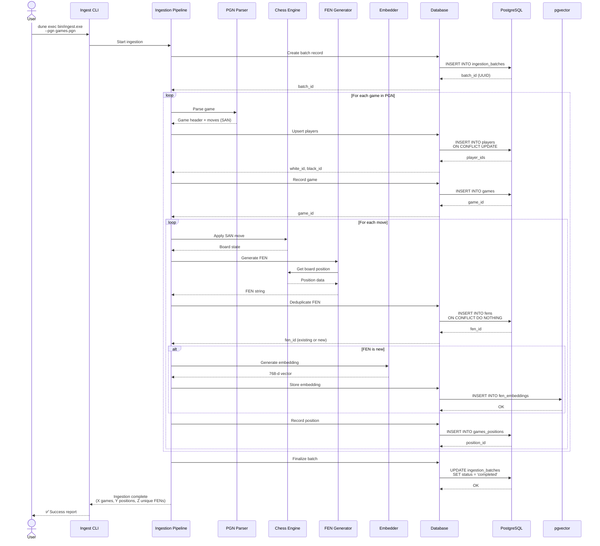
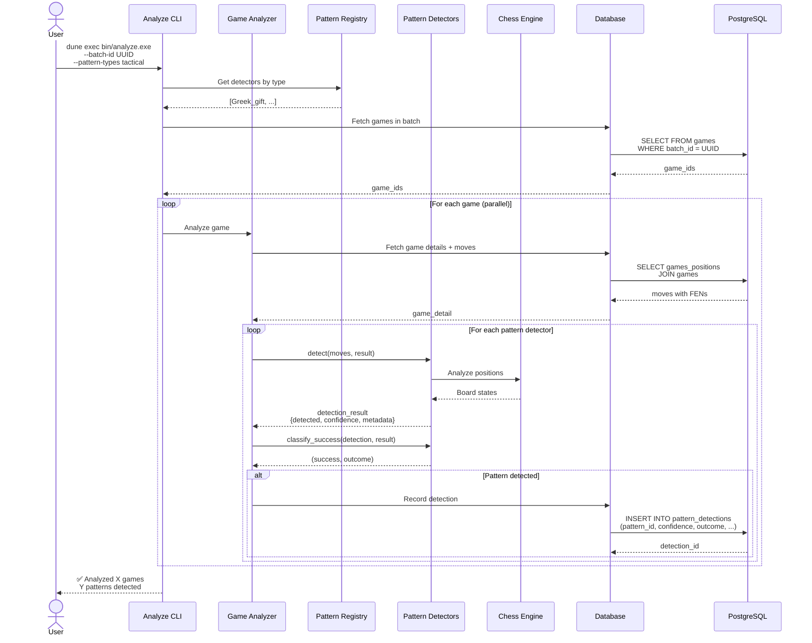
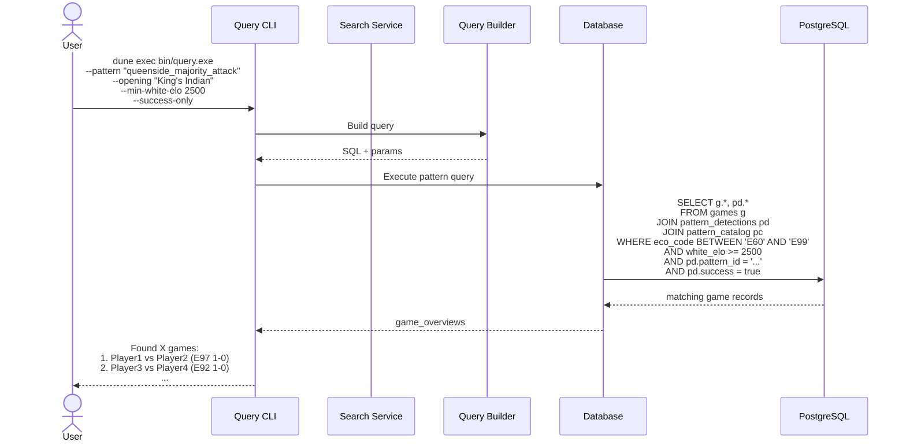
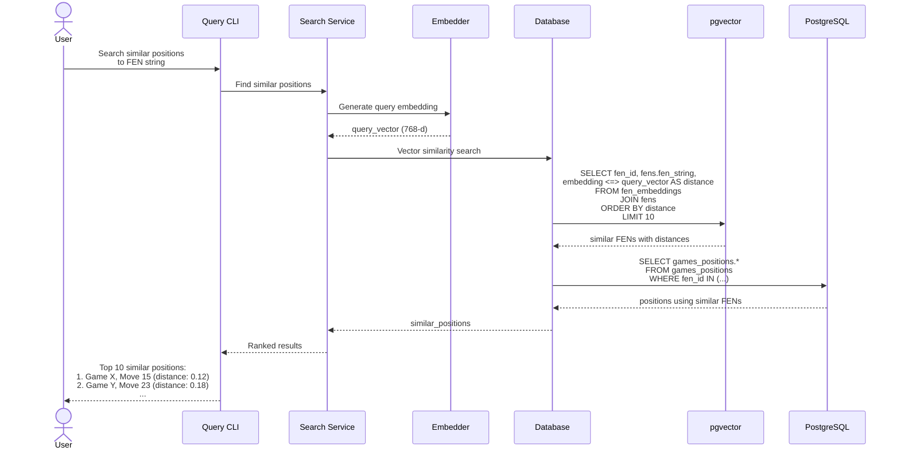

# ChessBuddy Architecture Diagram

This document contains Mermaid diagrams visualizing the ChessBuddy system architecture and data flows.

---

## System Architecture Overview



---

## Ingestion Flow



---

## Pattern Analysis Flow



---

## Retrieval Flow (Game Query)


---

## Search Flow (Pattern Query)



---

## Semantic Search Flow (Vector Similarity)



---

## Database Schema Overview

```mermaid
erDiagram
    PLAYERS ||--o{ GAMES : "plays as white"
    PLAYERS ||--o{ GAMES : "plays as black"
    INGESTION_BATCHES ||--o{ GAMES : contains
    GAMES ||--o{ GAMES_POSITIONS : "has moves"
    GAMES ||--o{ PATTERN_DETECTIONS : "has patterns"
    FENS ||--o{ GAMES_POSITIONS : "appears in"
    FENS ||--o| FEN_EMBEDDINGS : "has embedding"
    PATTERN_CATALOG ||--o{ PATTERN_DETECTIONS : "defines"
    PATTERN_DETECTIONS ||--o{ PATTERN_VALIDATION : "validated by"

    PLAYERS {
        uuid player_id PK
        text full_name
        text full_name_key
        int fide_id
        timestamptz created_at
    }

    INGESTION_BATCHES {
        uuid batch_id PK
        text label
        text pgn_source
        bytea pgn_sha256
        text status
        timestamptz started_at
        timestamptz completed_at
    }

    GAMES {
        uuid game_id PK
        uuid batch_id FK
        uuid white_id FK
        uuid black_id FK
        text event
        text site
        date game_date
        int round_num
        text result
        text eco_code
        text opening_name
        int white_elo
        int black_elo
        bytea pgn_hash
    }

    GAMES_POSITIONS {
        uuid position_id PK
        uuid game_id FK
        uuid fen_id FK
        int ply
        text san
        text uci
        text fen_before
        text fen_after
        jsonb annotations
    }

    FENS {
        uuid fen_id PK
        text fen_string
        text side_to_move
        text castling_rights
        text en_passant_square
        int halfmove_clock
        int fullmove_number
        text material_signature
    }

    FEN_EMBEDDINGS {
        uuid fen_id PK_FK
        vector embedding
        timestamptz created_at
    }

    PATTERN_CATALOG {
        text pattern_id PK
        text pattern_name
        text pattern_type
        text description
        text detector_module
        jsonb success_criteria
        bool enabled
    }

    PATTERN_DETECTIONS {
        uuid detection_id PK
        uuid game_id FK
        text pattern_id FK
        text detected_by_color
        bool success
        real confidence
        int start_ply
        int end_ply
        text outcome
        jsonb metadata
    }

    PATTERN_VALIDATION {
        uuid validation_id PK
        uuid detection_id FK
        bool manually_verified
        text verified_by
        timestamptz verified_at
        text notes
    }
```

---

## Data Flow Summary


---

## Component Responsibilities

| Component | Purpose | Key Functions |
|-----------|---------|---------------|
| **PGN Parser** | Parse chess game files | Extract headers, moves, annotations |
| **Chess Engine** | Board state management | Apply moves, validate positions, generate FENs |
| **FEN Generator** | Position notation | Convert board state to FEN strings |
| **Embedder** | Vector generation | Transform FENs to 768-d embeddings |
| **Pattern Detector** | Strategic analysis | Detect queenside attack, Greek gift, endgames |
| **Game Analyzer** | Batch pattern detection | Run all detectors on games |
| **Search Service** | Semantic search | Find similar positions via vector similarity |
| **Database Module** | Data persistence | CRUD operations, query execution |
| **PostgreSQL** | Relational storage | Games, players, moves, metadata |
| **pgvector** | Vector storage | Efficient similarity search on embeddings |

---

## Technology Stack


---

**Document Version:** 1.0
**Created:** 2025-10-04
**Last Updated:** 2025-10-04
